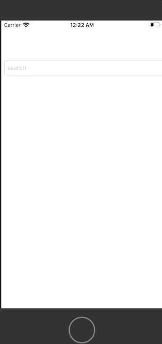

## moviesApplication 

**This project was built with the mvvm architecture. It includes base viewcontroller and viewmodel, allowing you to build on different projects. A clean code was tried.**

> MVVM Architecture

> Modular Architecture

> Observers

> No third-party Networking 

> Base ViewModel, Base ViewController

> Extensions

## Installation Guide

* git clone https://github.com/erenpapakci/moviesApplication.git

* cd moviesApplication

* pod install

